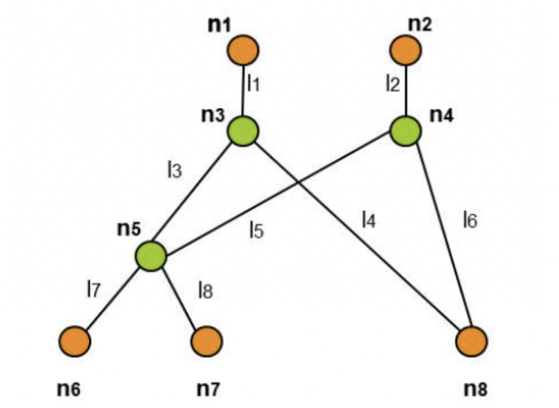
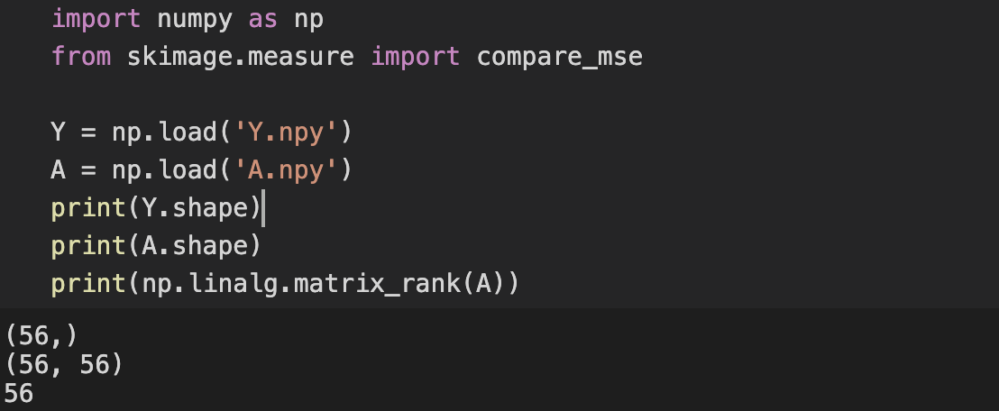
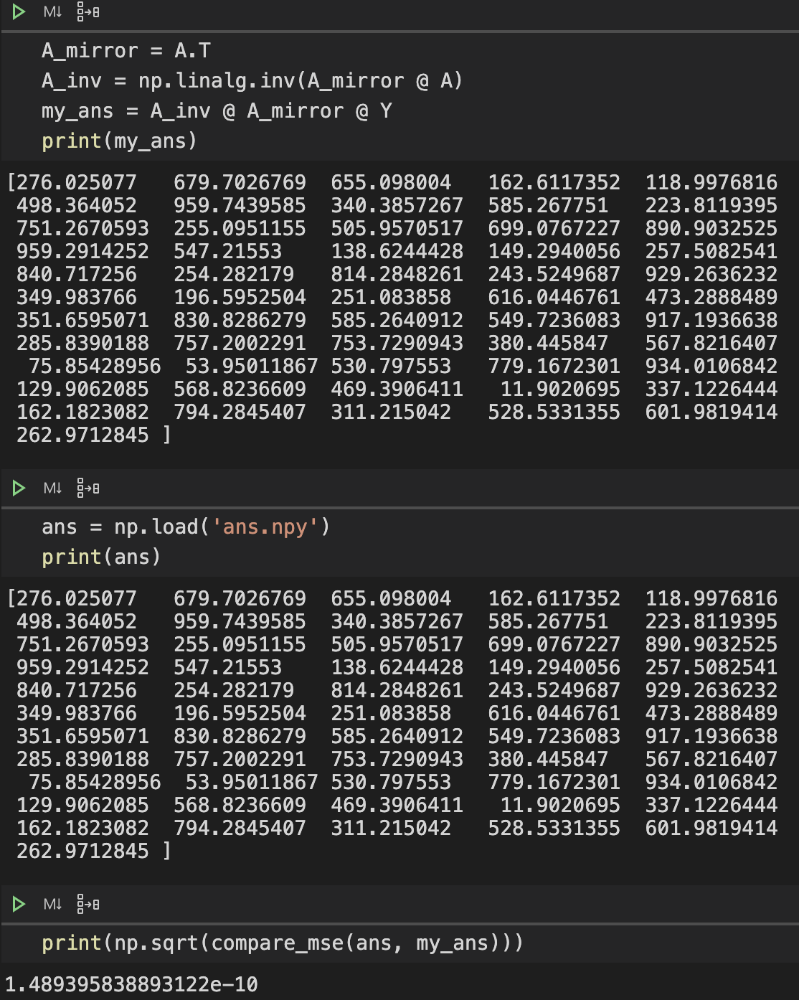

## $\text{Network Tomography}$——运筹学期末论文


###### 姓名 方晓坤       学号 2018202046         日期 2020-7-3


【摘要】在阅读$\text{Network Tomography}$这篇论文后，我将简要介绍网络测量问题的问题背景和它的形式化定义，并根据论文给出的伪代码算法实现网络测量的测量路径生成算法，最后对比算法给出的路径延迟和标准答案，并简单讨论$\text{Monitors}$在此问题中的作用和影响。

【关键词】网络测量；延迟；KSP

### 一、问题背景

​		网络测量$\text{(Network Tomography)}$问题，或者被称为网络诊断问题，是一种网络测量与推论方法，透过可收集到的有限资讯来推估无法观测的网络资讯，主要分成主动诊断$\text{(active tomography)}$与被动诊断$\text{(passive tomography)}$两类问题。

​		被动诊断是资料从个别节点搜集，去寻找路径上的资讯，问题在估计起始节点至终端节点之流量矩阵。主动诊断是借由设置接收节点，向接收节点发送大量的封包，根据接收节点收集到的测量数据，分析网络内部有兴趣的参数或识别网络拓扑结构。而衍生出来的统计问题称为统计反向问题$\text{(Statistical Inverse Problem)}$。

​		在本次课程论文实践过程中，我们对于一个给定的网络，需要自行选取个别节点充当$\text{Monitor}$。然后我们作为网络管理员，从外部计算两个$\text{Monitor}$之间的路径总延时（或者路径总丢包率，这里以总延时开展研究），然后推算出网络的每两个相邻的节点之间的延时（或者丢包率）。在了解到以上信息后，我们就可以对相邻两节点之间的通信作出调整和优化，所以说这种方法在网络测量中有着广泛的实际应用。


### 二、问题的形式化定义

​		例如下述网络，图中有$8$个节点，其中有$5$个节点是$\text{Monitors}$$\{n_1, n_2, n_6, n_7, n_8\}$，另外三个节点$n_3, n_4, n_5$是普通节点，图中有$8$个$\text{link}$是待检测的$\text{link}$$\{l_1, l_2, l_3, l_4, ..., l_8\}$，网络测量的问题就是通过$\text{Monitors}$之间测得的路径总延迟，分析网络中每个$\text{link}$的延迟的问题。



​		我们要做的就是实现论文中测量矩$A$的产生算法，并根据对应生成的路径测量值$Y$，求解出延迟$X$。即求解如下的线性方程组：
$$
Y = AX
$$
​		根据高等代数关于广义逆矩阵的相关知识，我们可以解出：
$$
X = (A^TA)^{-1}A^TY
$$
​		在已经得到$A$和$Y$的情况下，求解出$X$是非常容易的。所以，本次实验的重点在于，如何通过$\text{link delay}$构造测量路径。幸运的是，论文中给出了一种构造方法，下面我将谈谈我的实现。


### 三、测量路径构造算法的实现

​		在我充分阅读期末论文材料$\text{Network Tomography}$后，我了解了测量路径构造算法的基本思路。所以在我描述它的具体实现过程之前，我们先来看看它的大致框架。

#### 1、大致框架

​		首先，我们得到一个形式化描绘好的图网络$G$，它包括所有的点$V$和边$E$。我们选定一部分节点作为$B$——$\text{Monitors}$。同时初始化测量路径集合$P$和计数器$r$。

​		算法开始时，需要从$B$中选出两个节点，不妨记为$m_a, m_b$。这两个节点的选取自由度较高，似乎只要$m_a\ne m_b$，不是之前重复选取过的一对节点即可。在获得这一对节点后，为了充分利用，计算出多条两个节点为始末的路径。同时为了保证新加入的路径的有效性，应与之前的路径集合运算，判断是否线性无关。如果线性无关则加入$P$，若线性相关则舍弃。

​		当一对节点之间的路径都被评测完毕时，选取下一对顶点并重复上面的步骤，直到达到终止条件。在我的理解中，终止条件即得到一个列满秩矩阵——每一行代表一条路径，每一列代表一条边（由于最后的情况大概率是总路径数远大于$G$的边数）。当达成以上条件时，算法即返回测量路径集合$P$。我们可以同时获得它对应的延迟矩阵$Y$。

#### 2、准备工作

​		为了完成以上的构造算法，我们需要一定的准备工作。其中包括——将`.csv`文件存成方便读取的`.json`文件，实现简易的$\text{Yen-Ksp}$算法。

​		前者的任务相对轻松。我们只需要遍历`links.csv`的每一行，以$\text{start-node}$为$\text{key}$，$\text{end-node}$和对应的距离组成的字典为$\text{value}$，一并组成字典，再调用`json.dump`即可将字典存为`.json`文件。最后文件用于存图中的边，形式上是这样的：

```json
{
    "a":{
        "b":276.025077,
        "c":679.7026769,
        "g":655.098004,
        "h":162.6117352
    },
    "b":{
        "a":276.025077,
        "g":118.9976816
    },
    ...
}
```

​		由于节点一共有$25$个，且节点名没有特殊意义，所以不妨用`a-y`统一代替，这也会为下面的准备带来方便。

​		至于$\text{Yen-Ksp}$算法，老师给出了一个$\text{Python}$实现的版本。但是在详细阅读源码后发现，它所实现的只有有向图版本的$\text{KSP}$。当我将一条无向边转化为两条方向相反的有向边，又会遇到一个问题——我无法保证我通过它的程序获得的路径没有回路。即前一条最短路比如是`a->b->c`，而后一条是`a->b->a->b->c`。可是这两条路的矩阵表示并没有差异，所以在这个实际的网络延迟问题中，测量路径是不被允许存在回路的。

​		于是我只好自行实现了一个相对粗糙的$\text{KSP}$。它支持从上面的`.json`中读取网络，生成$K$条路径，并从中去除掉含有回路的路径。最终我们得到的即是不含回路的从$m_a$到$m_b$的多条路径。实际上这些路径延迟的大小关系并不重要，重要的是它们的构造方式。当设置一个$K$时，由于含回路路径的存在，最终得到的路径数量总是比较少。实际上，当$K$足够大的时候，我们就可以得到所有从$m_a$到$m_b$的路径。下面是一个样例和部分实现的核心代码：

```text
求得的 p-->r 的 200-最短路 分别是：
1:pqnwr 最短路长度：847.37289963
2:pqjnwvr 最短路长度：900.60062813
3:pqjcvr 最短路长度：1163.27882457
...
42:pqr 最短路长度：987.96080287
43:pqnwvr 最短路长度：833.36736673
44:pcur 最短路长度：1309.7535076
```

```python
def k_shortest_paths(self,start, finish, k = 3):
    '''
    :param start: 起始点
    :param finish: 终点
    :param k: 给出需要求的最短路数上限
    :return: 返回K最短路和最短路长度
    该算法重复计算了最短路，调用get_shortest_path()方法只是用到了起始点到其他所有点的最短距离和最短路长度
    '''
    distances, _, shortestPathLen = self.get_shortest_path(start, finish)
    num_shortest_path = 0
    paths = dict()
    distancesIncrementList = [[0, finish]]
    while num_shortest_path < k:
        path = []
        #distancesIncrementList = self.deleteCirclesWithEndpoint(distancesIncrementList,finish)
        minValue, minPath, minIndex = self.getMinDistancesIncrement(distancesIncrementList)
        smallest_vertex = minPath[-1]
        distancesIncrementList.pop(minIndex)

        if smallest_vertex == start:
            path.append(minPath[::-1])
            num_shortest_path += 1
            # type(path) -> list,不能作为字典的key
            paths[path[0]] = minValue + shortestPathLen
            # 字典采用{path ; pathlen}这样的键值对，不能使用{pathlen:path}
            # 因为key是唯一的，所以在此相同长度的path只能保存一个，后来的会覆盖前面的
            # paths[minValue + shortestPathLen] = path
            continue

        for neighbor in self.vertices[smallest_vertex]:
            incrementValue = minPath
            increment = 0
            if neighbor == finish:
                # 和函数deleteCirclesWithEndpoint()作用一样
                continue
            if distances[smallest_vertex] == (distances[neighbor] + self.vertices[smallest_vertex][neighbor]):
                increment = minValue
            elif distances[smallest_vertex] < (distances[neighbor] + self.vertices[smallest_vertex][neighbor]):
                increment = minValue + distances[neighbor] + self.vertices[smallest_vertex][neighbor] - distances[smallest_vertex]
            elif distances[neighbor] == (distances[smallest_vertex] + self.vertices[smallest_vertex][neighbor]):
                increment = minValue + 2 * self.vertices[smallest_vertex][neighbor]
            distancesIncrementList.append([increment, incrementValue + neighbor])
    return paths
```

#### 3、最终实现

​		除了上面的准备工作以外，我们还需要一些辅助功能函数——随机地取两个点，将路径转化为矩阵，去除含有圈的路径。

​		这两个函数都比较容易实现。前面的可以通过递归实现——随机两个字母对，如果已经用过了或者两个字母相同，则再随机一次，直到随机出两个合适的节点。

```python
def rand_chr():
    return chr(randint(ord('a'), ord('y')))

def rand_pair(used):
    pair = (rand_chr(), rand_chr())
    pair_rev = (pair[1], pair[0])
    if pair[0] != pair[1] and pair not in used and pair_rev not in used:
        used.append(pair)
        return pair
    else:
        return rand_pair(used)
```

​		至于将路径转化为矩阵。我分别为这已有的$56$条边编号$1-56$，并将其通过字典的方式存成`.json`。在获取一条路径后，通过比对字典确定出这条路径由哪些边组成。这里构造一个型为$1\times 64$的矩阵，若这条路径含有边$x$，就在矩阵的相应位置标$1$，否则标$0$。

```python
def path2matrix(path, links):
    matrix = np.zeros(56)
    for i in range(len(path) - 1):
        index = links[path[i]][path[i+1]]
        matrix[index-1] = 1
    return matrix
```

​		判断一条路径是否含圈，这个同样也比较容易。只要对一条路径中的所有节点计数，如果出现某个节点在该条路径中个数超过$1$个，则该条路径含有圈，返回`False`；否则，返回`True`。

```python
def check_path(path):
    for char in path:
        if(path.count(char)>1):
            return False
    return True
```

​		最后是论文算法的核心实现部分。

```python
		k = 250         # 用于设置两个节点之间的路径数量
    path_set = []   # 最终的不相关的路径集合
    cost = []       # 最终的路径集合的延迟
    used = []       # 记录哪些节点对已经用过
    count = 0       # 计数器 记下现在路径集合的秩
    while(count < 56):
        pair = rand_pair(used)
        start, end = pair

        paths = g.k_shortest_paths(start, end, k)
        for path, length in paths.items():
            if check_path(path):    # 路径不含回路
                if count == 0:  # 集合为空
                    path_set = path2matrix(path, links)
                    count = matrix_rank(path_set)
                    cost.append(length)
                else:   # 集合不空
                    tmp_path_set = np.vstack((path_set, path2matrix(path, links)))
                    if matrix_rank(tmp_path_set) > count:   # 不相关路径
                        path_set = tmp_path_set
                        cost.append(length)
                        count = matrix_rank(path_set)
    np.save('A', path_set)	# 将结果存成.npy方便再次加载
    np.save('Y', np.array(cost))
```


### 四、算法结果展示

​		为了对比的方便，我们先将标准答案读入并存成`ans.npy`。然后通过最初的公式，计算出我的答案，并和标准答案对比（这里采用的是均方误差）。



​		这里可以看到，$A$是一个$56\times56$的满秩矩阵，可以直接求逆$A^{-1}$。但我们为了运算的鲁棒性，仍求它的广义逆$(A^TA)^{-1}A^T$。



​		最终我们可以看到，我们所求的答案`my_ans`与标准答案`ans`极为接近，均方误差几乎可以忽略不计。也就是说，没有任何噪声干扰的$\text{Network Tomography}$是可以精确求解的。如果有一定程度的噪声，我们需要适当修改我们的数学模型。
$$
AX=Y \rightarrow AX+N=Y
$$
​		其中$N$为噪声信号。

​		如果知道噪声与信号的比例$NSR$，我们可以通过类似$\text{Wiener Filter}$的方式进行还原，应该也能得到不错的效果。


### 五、反思

​		关于上面的实际问题，事后我可以给出一组$\text{Monitors}$集合$B$。它们分别是：

```
b->e
b->q
b->y
c->o
d->n
f->l
g->t
h->p
j->x
k->q
q->s
q->v
u->v
```

​		由于$\text{Monitors}$集合$B$的选择是随机的，所以对最终结果的影响比较小。但实际情况是，如果缩小$KSP$算法的$K$值，每一对节点之间得到的路径数量会下降，可能会因此无法得到一个满秩的测量路径集合。可如果盲目扩大$K$值，会增加每一对节点之间路径的计算时间，同样会让计算效率下降。