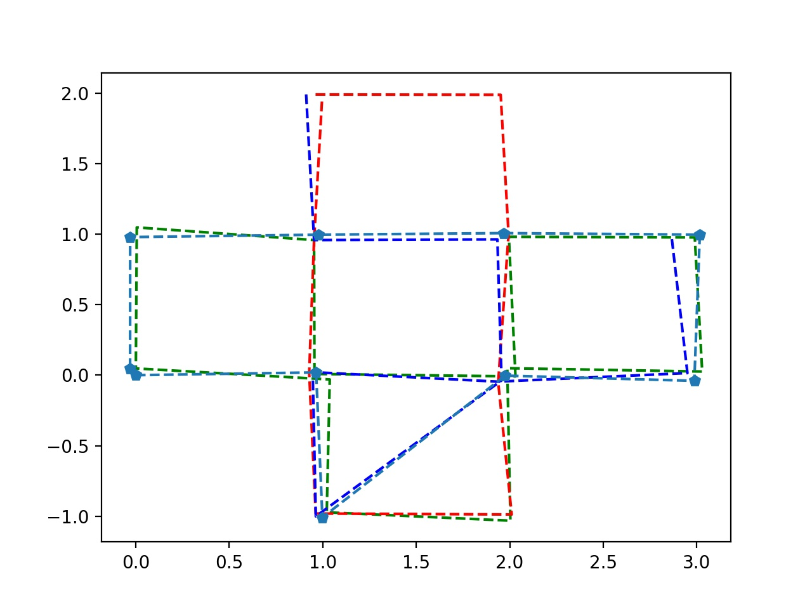

## 运筹学第五次实验


###### 姓名 方晓坤       学号 2018202046         日期 2020-6-20


## 一、需求分析

在学习了动态规划的思想后，我们设计并完成了这次$\text{Track Puzzle}$问题。这个问题要求我们将相对运动的轨迹拼接，实现对室内道路结构的还原

## 二、动态规划和详细解答

### 1、动态规划

阶段	选择下一个轨迹加入

状态	加入的所有轨迹的位置情况

决策	平移旋转

状态转移方程	将加入的轨迹按上面的抉择结果进行平移旋转，加入集合

指标函数	最大化重合或相近的点


### 2、详细解答

老师在习题课中认为判断两组点重合或相近的时候可以用$\text{LCS}$模型，这是动态规划的过程。但是我在仔细研究之后发现，轨迹的点是有重复的，也就是说轨迹是有回路的。然而$\text{LCS}$模型是不允许回路的存在的，即不允许两个点列中出现一对多或者多对多的情况。我们别无他法，只好求助于暴力搜索，好在数据量不大。

所以说，这次实验解决的并不是一个动态规划问题，主体上是一个贪心问题。下面是贪心的思路

首先我们先解决轨迹整体平移旋转的问题

```python
# 绕(pointx,pointy)顺时针旋转点(valuex, valuey)
def rotate(angle, valuex, valuey, pointx, pointy):
    valuex = np.array(valuex)
    valuey = np.array(valuey)
    sRotatex = (valuex-pointx)*cos(angle) + (valuey-pointy)*sin(angle) + pointx
    sRotatey = (valuey-pointy)*cos(angle) - (valuex-pointx)*sin(angle) + pointy
    return sRotatex, sRotatey

# 将一个轨迹上所有点绕(pointx, pointy)转动angle角度
def rotate_list(angle, point_list, pointx, pointy):
    result = []
    for valuex, valuey in point_list:
        x, y = rotate(angle, valuex, valuey, pointx, pointy)
        result.append([x, y])
    return result

# 将一个轨迹上第j个点与fix_list上第i个点对齐，平移
def move_list(fix_list, point_list, i, j):
    result = []
    for point in point_list:
        x = (point[0] + (fix_list[i][0] - point_list[j][0]))
        y = (point[1] + (fix_list[i][1] - point_list[j][1]))
        result.append([x, y])
    return result
```

导入轨迹和距离

```python
points = [
    [[0, 0], [0.005217503, 1.047483615], [0.953293989, 0.957596736], [0.955386293, 0.008701917], [2.030506, -0.00861], [1.995147, 0.980914], [2.989265, 0.976383], [3.028964, 0.025877], [1.986429, 0.049522], [2.003235, -1.03134], [1.021166, -0.97189], [1.037148, -0.03042], [-0.01713, 0.049236]],
    [[0, 0], [0.858448, 0.493237], [1.388912, -0.34111], [1.865861, -1.27813], [2.396924, -2.05344], [1.485651, -2.57171], [0.957324, -1.72617], [0.509099, -0.89764], [0.041019, -0.00021]],
    [[0, 0], [0.91545, -0.479492], [1.4015106, 0.3718813], [2.2782912, -0.108312], [2.6159703, -1.450452], [1.7224009, -0.953757], [2.2755487, -0.130468], [2.7299993, 0.7784378], [1.8392046, 1.1936134]],
    [[0, 0], [-0.019565105, 0.964250932], [1.008019183, 0.997847447], [0.003096445, 1.975683535], [0.040120809, 2.986909169], [-0.995944957, 3.016176491], [-1.006801939, 1.966960881], [-0.995733301, 0.977878402], [-0.978758519, -0.030177821], [-0.048332529, -0.030492847]]
]

dists = [
    [[5.016279514, 0.935040718], [4.690532681, 0.114626958], [3.634084718, 1.073260383], [4.761865813, 1.149580336], [3.553570989, 2.305426161], [2.723679102, 1.996288886], [2.378383212, 2.72126573], [3.16548357, 3.633352892], [3.951924163, 2.242067433], [4.021516298, 3.075044347], [4.736930384, 2.693413259], [4.592395991, 1.514475708], [5.057769309, 0.590346738]],
    [[3.755262203, 1.772784094], [3.411067053, 2.435701745], [3.387460015, 1.729886079], [3.681604732, 2.546696083], [4.146484056, 3.316866392], [4.589998815, 2.05700901], [4.483544894, 0.974819929], [4.348793549, 1.056555749], [4.029359902, 1.744195994]],
    [[4.358759034, 1.703242486], [3.940938679, 0.952207454], [3.41450563, 1.609861706], [3.215293644, 2.005951641], [5.024637345, 2.708719054], [4.68254464, 1.226073508], [3.397008403, 2.586425315], [3.240074549, 3.301553807], [1.991438275, 2.58866584]],
    [[5.723420395, 1.084718619], [4.92024469, 0.975242492], [5.084641303, 2.021176063], [3.933283449, 1.927054418], [2.770957087, 3.055689167], [2.562641957, 3.176871093], [2.869880695, 1.818104726], [3.756916611, 1.171462889], [5.170010589, -0.330232934], [5.032820584, 0.976079718]]
]
```

离散化旋转的角度

```python
angles = [0, 30, 60, 90, 120, 150, 180, 210, 240, 270, 300, 330]
```

判断两个点是否吻合

```python
# 根据点的坐标和dist来判断两个点是否吻合
def is_matched(point1, point2, dis1, dis2):
    if(sqrt((dis1[0] - dis2[0])**2 + (dis1[1] - dis2[1])**2) < 0.4 and \
        sqrt((point1[0] - point2[0])**2 + (point1[1] - point2[1])**2) < 0.2):
        return True
    else:
        return False
```

接下来就是贪心的过程

我选择了第一条轨迹作为基准，其他每一条轨迹的旋转平移都为了最大可能地与它重合

```python
best_i = -1
best_j = -1
best_angle = 0
count = 0
max_count = -1

index = 2   #   1, 2, 3
for i in range(len(points[0])):
    for j in range(len(points[index])):
        for angle in angles:
            
            count = 0

            after_move = move_list(points[0], points[index], i, j)  # 平移
            after_rotate = rotate_list(radians(angle), after_move, points[0][i][0], points[0][i][1])   # 旋转

            for k in range(len(points[0])): # 暴力计算匹配点的数量
                for l in range(len(points[index])):
                    if(is_matched(points[0][k], after_rotate[l], dists[0][k], dists[index][l])):
                        count+=1

            if count > max_count:   # 更新平移和旋转
                best_i = i
                best_j = j
                best_angle = angle
                max_count = count

print(best_i, best_j, best_angle, max_count)    # 打印最佳方案
```

打印出最佳的平移旋转方案和吻合的点的个数

由于数据量小，所以这里的多重循环并没有太高的实际复杂度$\text{10*10*10*10*10}$，运行时间大概$\text{1s}$

这样我们就得到了其他所有轨迹的最优方案(将轨迹中的第$\text{j}$个点移动到第一条轨迹中的第$\text{i}$个点的位置，然后整体顺时针旋转$\text{angle}$度数)

```python
i j angle
2	7	30	
2 1 60
0 0 90
```

最后我们得到最优的轨迹结果，并将它们绘制到一张图上

```python
#最佳平移旋转后的结果
list1 = np.array([[0, 0], [0.005217503, 1.047483615], [0.953293989, 0.957596736], [0.955386293, 0.008701917], [2.030506, -0.00861], [1.995147, 0.980914], [2.989265, 0.976383], [3.028964, 0.025877], [1.986429, 0.049522], [2.003235, -1.03134], [1.021166, -0.97189], [1.037148, -0.03042], [-0.01713, 0.049236]])
list2 = np.array([[0.961221321958746, 1.9895252794530633], [1.9512775977866896, 1.9874570515394885], [1.9934993975797983, 0.9996593539681536], [1.9380393478893825, -0.05029826988594088], [2.010298396899358, -0.9872679256940542], [0.9619778291165012, -0.9804664117134152], [0.9272032256112801, 0.015956208202479005], [0.953293989, 0.957596736], [0.9966398179965799, 1.9688339141182687]])
list3 = np.array([[0.9108212419114079, 1.9901456918944642], [0.953293989, 0.957596736], [1.9336351949037902, 0.9623425586212937], [1.956165898376708, -0.037068364524068476], [0.9626781129414614, -1.0005770434511345], [0.9460439008741733, 0.021624256993283852], [1.9356069895304597, -0.04577128985418977], [2.949967801977478, 0.015115845780729664], [2.8641230686089245, 0.9941544855372677]])
list4 = np.array([[0.0, 0.0], [0.964250932, 0.01956510500000006], [0.9978474470000002, -1.008019183], [1.975683535, -0.003096444999999879], [2.986909169, -0.04012080899999982], [3.016176491, 0.9959449570000002], [1.966960881, 1.0068019390000003], [0.9778784019999999, 0.9957333010000001], [-0.03017782100000006, 0.978758519], [-0.030492847000000003, 0.048332529]])

#绘制最终轨迹图
x1 = list1[:, 0]
y1 = list1[:, 1]
x2 = list2[:, 0]
y2 = list2[:, 1]
x3 = list3[:, 0]
y3 = list3[:, 1]
x4 = list4[:, 0]
y4 = list4[:, 1]
fig = plt.figure()
ax1 = fig.add_subplot(1, 1, 1)
ax1.plot(x1, y1, 'g--', x2, y2, 'r--', x3, y3, 'b--', x4, y4, 'p--')
plt.show()
```

结果如下图



由于测量存在一定误差，甚至有的$\text{distence}$的结果出现了负值，所以说做到这个结果，可以说是比较满意的

